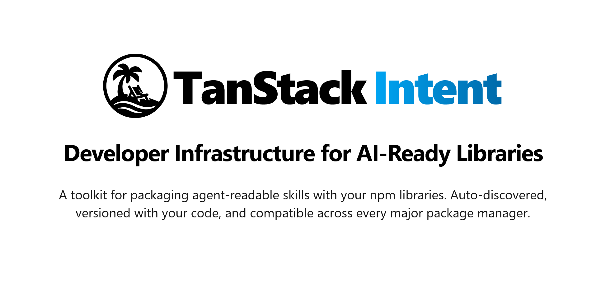

  

 

	
- 
	

	
	

### [Become a Sponsor!](https://github.com/sponsors/tannerlinsley/)

# TanStack Intent

A toolkit for packaging agent-readable skills with your npm libraries. Auto-discovered, versioned with your code, and compatible across every major package manager.

### <a href="https://tanstack.com/intent">Read the docs →</b></a>

## Get Involved

- We welcome issues and pull requests!
- Participate in [GitHub discussions](https://github.com/TanStack/intent/discussions)
- Chat with the community on [Discord](https://discord.com/invite/WrRKjPJ)
- See [CONTRIBUTING.md](./CONTRIBUTING.md) for setup instructions

## Partners

<table align="center">
  <tr>
    <td>
      <a href="https://www.coderabbit.ai/?via=tanstack&dub_id=aCcEEdAOqqutX6OS" >
        <picture>
          <source media="(prefers-color-scheme: dark)" srcset="https://tanstack.com/assets/coderabbit-dark-D643Zkrv.svg" height="40" />
          <source media="(prefers-color-scheme: light)" srcset="https://tanstack.com/assets/coderabbit-light-CIzGLYU_.svg" height="40" />
          
        </picture>
      </a>
    </td>
    <td>
      <a href="https://www.cloudflare.com?utm_source=tanstack">
        <picture>
          <source media="(prefers-color-scheme: dark)" srcset=https://tanstack.com/assets/cloudflare-white-Co-Tyjbl.svg" height="60" />
          <source media="(prefers-color-scheme: light)" srcset="https://tanstack.com/assets/cloudflare-black-6Ojsn8yh.svg" height="60" />
          
        </picture>
      </a>
    </td>
  </tr>
</table>

We're looking for TanStack Intent Partners to join our mission! Partner with us to push the boundaries of TanStack intent and build amazing things together.

<a href="mailto:partners@tanstack.com?subject=TanStack Intent Partnership"><b>LET'S CHAT</b></a>

## Explore the TanStack Ecosystem

- <a href="https://github.com/tanstack/config"><b>TanStack Config</b></a> – Tooling for JS/TS packages
- <a href="https://github.com/tanstack/db"><b>TanStack DB</b></a> – Reactive sync client store
- <a href="https://github.com/tanstack/devtools"><b>TanStack DevTools</b></a> – Unified devtools panel
- <a href="https://github.com/tanstack/form"><b>TanStack Form</b></a> – Type‑safe form state
- <a href="https://github.com/tanstack/query"><b>TanStack Query</b></a> – Async state & caching
- <a href="https://github.com/tanstack/ranger"><b>TanStack Ranger</b></a> – Range & slider primitives
- <a href="https://github.com/tanstack/router"><b>TanStack Router</b></a> – Type‑safe routing, caching & URL state
- <a href="https://github.com/tanstack/router"><b>TanStack Start</b></a> – Full‑stack SSR & streaming
- <a href="https://github.com/tanstack/store"><b>TanStack Store</b></a> – Reactive data store
- <a href="https://github.com/tanstack/table"><b>TanStack Table</b></a> – Headless datagrids
- <a href="https://github.com/tanstack/virtual"><b>TanStack Virtual</b></a> – Virtualized rendering

… and more at <a href="https://tanstack.com"><b>TanStack.com »</b></a>

<!-- USE THE FORCE LUKE -->
